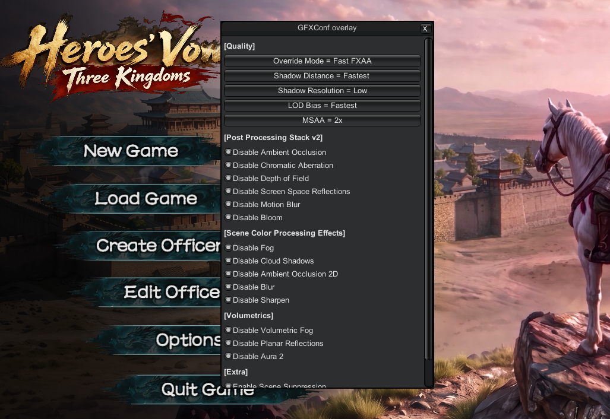

# Heroes' Vow: Three Kingdoms Graphics Config

A lightweight BepInEx 6 (IL2CPP) mod for *Heroes' Vow: Three Kingdoms* that disables expensive visual effects at runtime, so the game runs more smoothly on lower-end hardware. Settings live in a simple config file and can be flipped live from an in-game overlay. It **never modifies any game asset file**.

## Features

- **Per-effect toggles** — PPv2 (Ambient Occlusion, Chromatic Aberration, Depth of Field, Screen Space Reflections, Motion Blur, Bloom), SCPE (Fog, Cloud Shadows, Ambient Occlusion 2D, Blur, Sharpen), Volumetric Fog, Planar Reflections, and Aura 2.
- **Antialiasing override** — force `None` / `FXAA` / `SMAA` / `TAA`, or keep the game default.
- **`[Quality]` overrides** — shadow distance, shadow resolution, LOD bias, and MSAA.
- **F10 overlay** — flip any toggle live; the config file stays the source of truth.
- **Idle-scene render suppression** — freezes a 3D snapshot and stops drawing scene cameras in configured idle scenes while keeping screen-space UI live (F9 captures a new scene).

## Install

1. Install **BepInEx 6** (Unity IL2CPP, win-x64 build) into the game folder
   `...\steamapps\common\LegendOfHeros\`. This creates `BepInEx\` and
   `winhttp.dll` next to `ThreeKingdom.exe`. On first launch BepInEx generates
   its interop assemblies (`BepInEx\interop\`) — this is normal and only
   happens once.
2. Copy `GFXConf.dll` into `BepInEx\plugins\`.
3. Launch the game. On the first launch GFXConf creates its config file
   `BepInEx\config\gfxconf.cfg` with all defaults.

Press **F10** in game to open the overlay and change settings live. Scene
settings are edited in `gfxconf.cfg` (with the game closed) and applied on the
next launch.

## Uninstall

Delete `BepInEx\` **and** `winhttp.dll` from the game folder. The game then
boots exactly like a stock install (Steam integrity is untouched — BepInEx only
adds files, and Steam Verify ignores extras).

> Do **not** delete anything inside `ThreeKingdom_Data\` — those are real game
> files; GFXConf never touches them.
